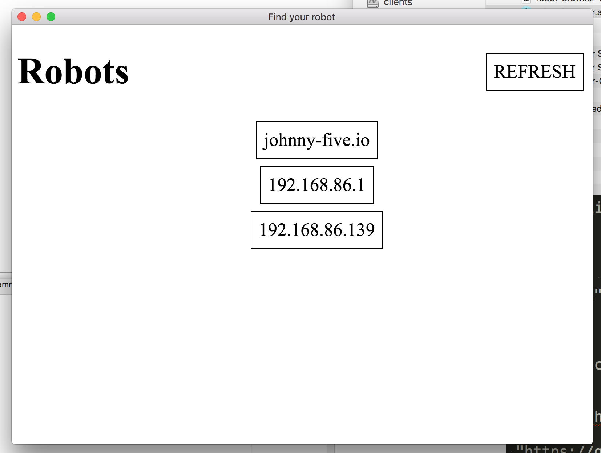

# Robot Browser

Gives you links to any http server on your network.

[Download!](https://github.com/reconbot/robot-browser/releases) for windows and mac

Scans your local network for any open port 80s. Hopefully it's your robot! I made this so you don't have to go searching for the IP address of your robot.

## Features
- Refresh
- Keyboard shortcuts
- Full Screen!
- Link to Johnny-Five.io!
- Link to your router's homepage? Sure! Why not!

## Development

- `npm run pack` to build for mac and test it out
- `npm run dist` to build installers for mac and pc
- `npm run release` to upload to github

Follow the [nodebots code of conduct](http://nodebots.io/conduct.html), and commit away! Patches welcome as I'm sure this could do more.
